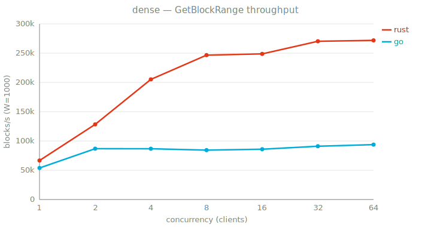
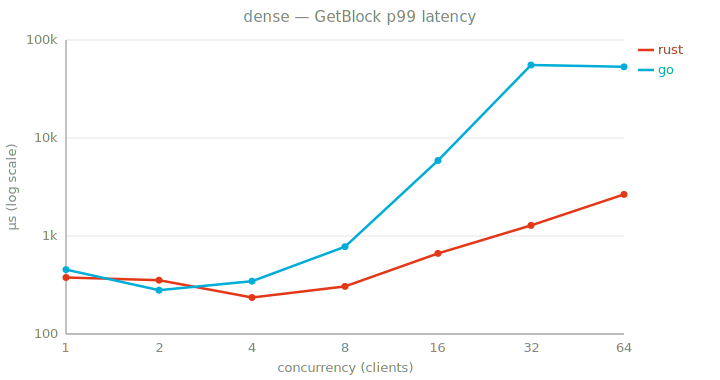
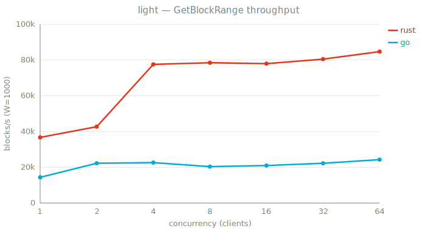
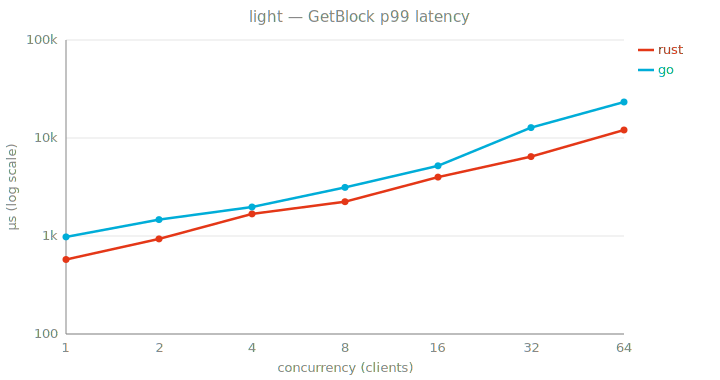
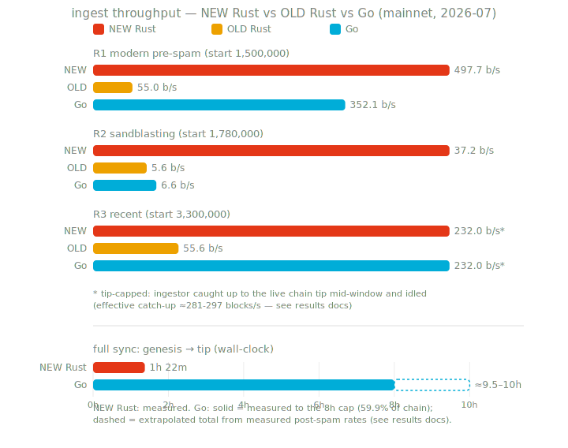

# lightwalletd-rs

[](https://github.com/jpgonzalezra/lightwalletd-rs/actions/workflows/ci.yml)
[](LICENSE)

A Rust lightwalletd for Zcash: a caching proxy that serves compact blockchain data to shielded light
wallets over gRPC.

> **Beta software.** lightwalletd-rs is under active development and has not been security-audited.
> Expect breaking changes, and run it at your own risk — it is provided "as is", without warranty of
> any kind (see [LICENSE](LICENSE)).

## Overview

`lightwalletd-rs` is neither a node nor a wallet. It is a **caching proxy** between a Zcash full node
([`zebrad`](https://github.com/ZcashFoundation/zebra)) and light wallets:

```
            gRPC (CompactTxStreamer)            JSON-RPC (HTTP)
  wallet  <───────────────────────>  lightwalletd-rs  <───────────────────────>  zebrad (full node)
  (Zcash                               - serves compact blocks                     - has the full chain
   light                               - caches them on disk
   wallets)                            - proxies the rest
```

It ingests blocks from the node and converts each into a `CompactBlock` — a pruned form with the zk proofs
stripped, so a block shrinks from ~2 MB to a few KB — caches them on disk, and streams them to wallets over
the standard Zcash light-client gRPC. The remaining calls (send transaction, tree state, mempool,
transparent-address balances) are proxied to the node.

For the full design see [`docs/ARCHITECTURE.md`](docs/ARCHITECTURE.md); for the specifications it
implements, [`docs/protocol-references.md`](docs/protocol-references.md).

## Features

- **All 20 `CompactTxStreamer` methods** — blocks, transactions, tree state, subtrees, nullifiers,
  transparent-address balances and txids, and mempool streaming.
- **On-disk compact-block cache** (`redb`) filled by a background ingestor, with reorg rollback and
  automatic recovery from corruption or gaps.
- **TLS by default** — plaintext requires an explicit opt-in flag.
- **Prometheus metrics on by default** (`127.0.0.1:9068`) and gRPC Server Reflection — per-method request
  counts/latency histograms, and `grpcurl`-discoverable services with no local `.proto` checkout.
- **Hardened by default** — up-front input validation, per-connection stream and keepalive limits, and a
  graceful drain on `SIGINT`/`SIGTERM`.
- **Darkside test mode** — a controllable in-memory mock chain for deterministic wallet tests.

## Requirements

- **Rust** (stable, 2024 edition).
- **`protoc`**, the Protocol Buffers compiler, on `PATH` — the `.proto` contract is compiled at build time.
  Install it with `brew install protobuf` (macOS) or `apt-get install -y protobuf-compiler` (Debian/Ubuntu).
- A reachable **`zebrad`** node with JSON-RPC enabled (mainnet, testnet, or regtest), synced far enough to
  serve the range you need.

## Quickstart

Build the binary:

```sh
cargo build --release      # or: make build
```

Run it against a local `zebrad`, in plaintext (local development only):

```sh
./target/release/lightwalletd-rs \
  --rpc-url http://127.0.0.1:8232 \
  --rpc-user "$RPC_USER" --rpc-password "$RPC_PASSWORD" \
  --grpc-bind 127.0.0.1:9067 \
  --no-tls-very-insecure
```

On first start it ingests from Sapling activation (or `--start-height`) and fills the on-disk cache under
`--data-dir`; later starts resume from the cache. Once it is serving, point a wallet at
`127.0.0.1:9067` — it speaks the standard Zcash light-client gRPC, so Zcash light wallets connect
unchanged.

For anything beyond local testing, serve over [TLS](#tls) instead of `--no-tls-very-insecure`.

## Configuration

The proxy needs two things: how to reach the node, and where to listen.

**Backend node.** Point it at `zebrad`'s JSON-RPC with `--rpc-url`, or with `--rpc-host` / `--rpc-port`
(defaults `127.0.0.1:8232`). Credentials come from `--rpc-user` / `--rpc-password`, or from a `zcash.conf`
via `--zcash-conf` (which reads `rpcuser` / `rpcpassword` / `rpcbind` / `rpcport`). Flags take precedence
over the file.

| Flag | Default | Purpose |
|---|---|---|
| `--grpc-bind` | `127.0.0.1:9067` | gRPC listen address |
| `--rpc-url` | — | full JSON-RPC URL of the node (overrides `--rpc-host`/`--rpc-port`) |
| `--rpc-user` / `--rpc-password` | — | node RPC credentials (or via `--zcash-conf`) |
| `--zcash-conf` | — | read credentials and host/port from a `zcash.conf` |
| `--data-dir` | `./lightwalletd-rs-data` | directory for the on-disk block cache |
| `--start-height` | Sapling activation | height to ingest from when the cache is empty |
| `--tls-cert` / `--tls-key` | — | PEM certificate / key (required unless `--no-tls-very-insecure` or `--gen-cert-very-insecure`) |
| `--metrics-bind` | `127.0.0.1:9068` | address to serve Prometheus `/metrics` on (disable with `--no-metrics`) |
| `--log-level` | `info` | tracing filter (an explicit `RUST_LOG` env var always wins) |
| `--log-file` | — | write JSON lines here instead of human-readable stderr output |

Run `lightwalletd-rs --help` for the full list, including cache resync (`--sync-from-height`,
`--redownload`, `--nocache`) and per-connection resource limits (`--max-concurrent-streams`, `--keepalive-*`).
`--ingest-window`/`--ingest-concurrency` and `--log-level`/`--log-file` also read from
`LWD_INGEST_WINDOW`/`LWD_INGEST_CONCURRENCY`/`LWD_LOG_LEVEL`/`LWD_LOG_FILE` when the flag is absent.

## TLS

The gRPC server runs over TLS by default: `--tls-cert` and `--tls-key` are required unless you pass
`--no-tls-very-insecure` (plaintext — development only, never in production) or `--gen-cert-very-insecure`
(an in-memory self-signed certificate generated at startup — also development only). For local testing you
can instead generate a self-signed pair yourself:

```sh
openssl req -x509 -newkey rsa:4096 -nodes -keyout key.pem -out cert.pem -days 365 \
  -subj "/CN=localhost" -addext "subjectAltName=DNS:localhost,IP:127.0.0.1"
```

See [`docs/ARCHITECTURE.md#tls`](docs/ARCHITECTURE.md#tls) for details.

## Observability

Prometheus metrics — per-method request counts and latency histograms — are served on `/metrics` at
`127.0.0.1:9068` **by default**; override the address with `--metrics-bind` or turn it off entirely with
`--no-metrics`:

```sh
lightwalletd-rs ...                        # metrics on 127.0.0.1:9068
lightwalletd-rs ... --metrics-bind 127.0.0.1:9100
lightwalletd-rs ... --no-metrics
```

Because metrics are on by default, two instances on the same host collide on `:9068`: the second
instance logs an `error` for the failed bind and keeps serving **without metrics** rather than
exiting. Give each instance its own `--metrics-bind` address (or `--no-metrics`).

See [`docs/ARCHITECTURE.md#metrics`](docs/ARCHITECTURE.md#metrics).

gRPC Server Reflection is always registered, so `grpcurl -plaintext <addr> list` (and `describe`) work
against a running server with no local `.proto` checkout needed.

Logging defaults to human-readable text on stderr, controlled by `--log-level` (an explicit `RUST_LOG`
always wins). `--log-file <path>` switches to JSON lines appended to that file instead. See
[`docs/ARCHITECTURE.md#logging`](docs/ARCHITECTURE.md#logging).

## Docker

```sh
docker build -t lightwalletd-rs .
docker compose up        # a zebra node + lightwalletd-rs
```

`docker-compose.yml` brings up a `zebra` node and the proxy in front of it, serving over TLS from a
certificate mounted at `./certs` (see the comments in that file). The node syncs the chain on first run,
which takes hours and tens to hundreds of GB.

## Development

```sh
make build      # compile
make test       # unit + end-to-end tests
make lint       # clippy -D warnings
make fmt        # check formatting
make verify     # fmt + lint + build + test (the pre-commit check)
```

`make test` runs the unit tests and a suite of deterministic end-to-end tests (`tests/`) that drive an
in-process darkside server over gRPC with vendored, network-free data. `contrib/smoke-test.sh` is an
optional manual check that drives a live darkside binary with `grpcurl` and `jq`; it downloads data from
the internet, so it is not run in CI.

## Advanced

### Darkside mode

`--darkside-very-insecure` serves a controllable, in-memory mock chain instead of proxying a real node, for
deterministic wallet tests (reorgs, confirmations, edge cases). It exposes a `DarksideStreamer` control
plane alongside the normal `CompactTxStreamer`. Testing only — never use it in production. It shuts itself
down after `--darkside-timeout-minutes` (default 30) so a forgotten or leaked mock server does not run
forever. See [`docs/ARCHITECTURE.md#darkside-mode`](docs/ARCHITECTURE.md#darkside-mode).

### Donation address

`--donation-address u1...` advertises a Zcash unified address in `GetLightdInfo`. Wallets read it to offer
users the option of donating to whoever operates the server; it is advisory only and carries no payment
logic. The address is decoded at startup, so a malformed or truncated one fails fast rather than being
served.

### Ping

`--ping-very-insecure` enables the `Ping` gRPC, a benchmark/testing call. It is off by default: a client
controls both the sleep duration and the concurrency it observes, so leaving it open is a needless
denial-of-service surface.

## Performance

A reproducible harness in [`contrib/bench/`](contrib/bench/) measures the hot read-path — serving
compact blocks from a warm cache with the node idle — for both this implementation and the reference Go
[`lightwalletd`](https://github.com/zcash/lightwalletd), under identical resource limits, plus a separate
ingest/full-sync comparison against a real mainnet node. The comparison here is a deliberate,
method-first exception to this project's usual no-comparison stance; the read-path methodology is
recorded in [ADR 0017](docs/decisions/0017-benchmark-methodology.md), and the windowed ingestor itself in
[ADR 0020](docs/decisions/0020-windowed-ingest-batched-commits.md).

**Environment disclaimer.** All numbers below (read-path and ingest alike) were captured 2026-07-13/14
on a Debian 12 host (kernel 6.1.0-40-amd64), AMD Ryzen 7 7840HS, 16 CPUs, 28 GiB RAM, against a real,
fully synced `zebrad v6.0.0` mainnet node (JSON-RPC, no auth). Pinned versions: this tree `3dfb1c9`; the
pre-windowed-ingestor OLD Rust baseline `3885827` (used only for the ingest A/B/C comparison); Go
`fdf1af5` for the read-path harness container and `61fee32` (current master at run time) for the ingest
comparison; `ghz v0.121.0`; Docker 29.0.0 / Compose v2.40.3. The read-path harness still caps both
proxies at 2 vCPU / 2 GiB inside Docker Compose, but this run used native Linux Docker rather than the
harness's original Docker-Desktop-on-macOS-arm64 target, so it carries no VM overhead. **Two `zebrad`
nodes (mainnet + testnet) ran throughout every measurement** — nontrivial background CPU/disk load
shared by both implementations under test. Read every number below as relative, not absolute.

### Read path (contrib/bench)

Two mainnet profiles are measured: **dense** (post-NU5, blocks 3,350,000–3,361,999, with Sapling/Orchard
activity) and **light** (pre-Sapling, blocks 20,000–31,999, **no shielded content**). Both proxies serve
identical compact blocks (see the fairness note below), so this is a like-for-like comparison. Numbers
below are the **median over 5 reps** (warm-up discarded) at each concurrency, from a full sweep of the
documented default curve (concurrency 1–64, `REPS=5`, `DURATION=8s`; tables from `scripts/aggregate.py`,
charts from `scripts/plot.py`).

At a glance: once concurrency exceeds 2, Rust dominates `GetBlockRange` throughput on both profiles
(dense: ~330k blocks/s plateau vs Go's 60k–140k; light: ~105k–146k vs Go's 7k–80k) and holds flat
`GetBlock` p99s under load, where Go's p99 blows out to 33–55 ms at concurrency ≥ 16. Go wins
low-concurrency (c = 1–2) dense range streaming and `GetBlock` p50 at moderate concurrency. Rust's `redb`
cache is larger on disk (~2.3× on both profiles); Go's peak RSS runs ~3× Rust's on dense. The throughput
charts use a 1,000-block `GetBlockRange` window per request (W = 1000); the harness also records 100- and
10,000-block windows.

### dense (post-NU5)





| impl | peak RSS (MiB) | cache on disk (MiB) | max CPU (cores) |
|---|---|---|---|
| rust | 79.2 | 45.8 | 2.00 |
| go | 250.5 | 19.5 | 2.03 |

<details>
<summary>Full numbers — GetBlock latency and GetBlockRange throughput (W = 1000)</summary>

`GetBlock` latency — median p50 / p99 (µs):

| concurrency | rust p50 | rust p99 | go p50 | go p99 |
|---|---|---|---|---|
| 1 | 242 | 377 | 247 | 454 |
| 2 | 152 | 354 | 115 | 280 |
| 4 | 115 | 236 | 125 | 346 |
| 8 | 141 | 306 | 174 | 778 |
| 16 | 307 | 664 | 234 | 5897 |
| 32 | 669 | 1284 | 392 | 55552 |
| 64 | 1496 | 2657 | 807 | 53214 |

`GetBlockRange` throughput — median blocks/s (W = 1000):

| concurrency | rust | go |
|---|---|---|
| 1 | 28,971 | 55,499 |
| 2 | 66,124 | 59,123 |
| 4 | 215,960 | 60,251 |
| 8 | 323,195 | 69,118 |
| 16 | 323,573 | 70,638 |
| 32 | 318,823 | 80,898 |
| 64 | 321,345 | 87,159 |

</details>

### light (pre-Sapling)

Because pre-Sapling blocks carry no Sapling/Orchard data, `GetBlockRange` (shielded-only by default)
serves near-empty blocks here — this profile measures the framing/overhead floor of the wallet-sync path.
The full blocks still carry heavy transparent transaction data (many `vin`/`vout` plus per-transaction
overhead) and this range averages 4.18 txids/block, so **`GetBlock` (which returns the full compact
block) and the on-disk footprint are larger than on `dense`**, not smaller.





| impl | peak RSS (MiB) | cache on disk (MiB) | max CPU (cores) |
|---|---|---|---|
| rust | 204.0 | 257.0 | 2.16 |
| go | 262.9 | 109.2 | 2.04 |

<details>
<summary>Full numbers — GetBlock latency and GetBlockRange throughput (W = 1000)</summary>

`GetBlock` latency — median p50 / p99 (µs):

| concurrency | rust p50 | rust p99 | go p50 | go p99 |
|---|---|---|---|---|
| 1 | 1125 | 1509 | 1211 | 1795 |
| 2 | 955 | 1937 | 458 | 1225 |
| 4 | 436 | 1082 | 494 | 988 |
| 8 | 596 | 1051 | 656 | 2999 |
| 16 | 865 | 2116 | 1100 | 34003 |
| 32 | 1555 | 5098 | 2076 | 36411 |
| 64 | 2870 | 11162 | 3953 | 33827 |

`GetBlockRange` throughput — median blocks/s (W = 1000):

| concurrency | rust | go |
|---|---|---|
| 1 | 41,847 | 7,375 |
| 2 | 61,617 | 7,875 |
| 4 | 110,120 | 13,373 |
| 8 | 111,988 | 13,498 |
| 16 | 111,090 | 15,877 |
| 32 | 113,337 | 19,875 |
| 64 | 118,177 | 24,760 |

</details>

### Read-path notes

- **Fairness (identical blocks).** `populate.sh` verifies this on every run and refuses to proceed on a
  mismatch: the `GetBlockRange` stream over each full range — 12,000 blocks per profile, 24,000 total —
  hashes identically between Rust and Go (content identity: the responses decode to the same messages,
  not a wire-byte claim). The unary `GetBlock` path was additionally spot-checked at sampled heights.
- **Dual source of truth.** Client-side (`ghz`) and server-side (`grpc_server_handling_seconds`) both
  corroborate the same ordering; for streaming `GetBlockRange` the two servers time the handler
  differently (tonic returns the stream lazily and records only stream setup; `grpc_prometheus` times the
  full drain), so the client-side throughput above — where `ghz` drains the whole stream identically for
  both — is the comparable measure.
- **Saturation.** Both proxies approach their 2-vCPU cap at high concurrency (measured ~2.0–2.16 cores;
  cgroup CPU accounting reads a few percent over the cap — e.g. light Rust's 2.16 — from sampling
  jitter), so the upper curve is a saturation regime, not linear scaling.
- **Cache on disk.** Measured after population. The Rust `redb` cache is larger than Go's flat
  append-only files on both profiles (~2.3×) — B-tree overhead, most visible on the transparent-heavy
  `light` profile. The dense Rust figure (45.8 MiB) carries some churn from interrupted first-populate
  attempts under this run; a pristine single-pass ingest may land somewhat smaller.
- **Fidelity.** The smaller `GetBlockRange` window (W = 100) is noisier than W = 1000 / 10000 — see the
  ± spread in the raw `aggregate.py` output. The harness records the full curve (W ∈ {100, 1000, 10000});
  reproduce with `run-bench.sh`, then `aggregate.py` (tables) and `plot.py` (charts).

### Ingest and full-sync (vs the real mainnet node)

The windowed concurrent ingestor ([ADR 0020](docs/decisions/0020-windowed-ingest-batched-commits.md))
fetches up to `--ingest-window` blocks (default 64) with `--ingest-concurrency` concurrent node requests
(default 8) and commits each window in one cache transaction, instead of one round-trip and one fsync
per block. It was benchmarked three ways against the same live mainnet `zebrad`: **A/B/C** fixed
480-second ingest windows at three start heights (this tree vs the pre-windowed OLD Rust baseline vs Go);
**B4** a complete genesis-to-tip wall-clock sync; **B1** a tuning sweep; **B2** read-path latency while
the ingestor runs flat out.



**A/B/C — blocks ingested in a fixed 480 s window, one implementation at a time:**

| range | start height | NEW Rust blocks (b/s) | OLD Rust blocks (b/s) | Go blocks (b/s) |
|---|---|---|---|---|
| R1 modern pre-spam | 1,500,000 | **238,912 (497.7)** | 26,401 (55.0) | 169,016 (352.1) |
| R2 sandblasting | 1,780,000 | **17,856 (37.2)** | 2,701 (5.6) | 3,170 (6.6) |
| R3 recent | 3,300,000 | 111,353 (232.0)\* | 26,701 (55.6) | 111,367 (232.0)\* |

\* R3 is **tip-capped** for NEW Rust and Go — both fully caught up to the live chain tip inside the
480 s window and then idled (NEW Rust's effective catch-up before tip was ≈297 blocks/s, Go's ≈281
blocks/s); the OLD baseline was nowhere near tip-capped. NEW vs OLD Rust: 9.0× (R1), 6.6× (R2), 4.2×+
(R3, capped). NEW Rust vs Go: 1.41× (R1), 5.6× (R2, the sandblasting era's heavy shielded blocks), parity
on R3 only because both were tip-capped. Zero txid/hash-mismatch errors across all nine runs.

**Full sync, genesis to tip, default settings:** NEW Rust completed in **4,950 s (1 h 22 m 30 s)**,
689 blocks/s overall, 42.0 GiB final cache (13.2 KB/block). Go did **not** finish inside an 8-hour cap:
stopped at **2,046,039 / 3,412,340 (59.9%)**, 71.0 blocks/s to that point, 25.6 GiB cache
(13.4 KB/block); extrapolating its own measured post-spam rates over the remaining, entirely-post-spam
chain gives **≈34,000–36,000 s (≈9.5–10 h)** total. Both runs were error-free. **The windowed ingestor is
worth ≈7× on a full sync**, and nearly the entire gap sits in the sandblasting segment (1.5M→2.0M):
Rust crossed it at 148 blocks/s (3,370 s) against Go's 22 blocks/s (23,181 s) — 6.9× — while Rust's own
non-spam segments ran 1,000–2,400 blocks/s and Go's pre-spam segments ran 310–374 blocks/s, both
fundamentally node-bound per request.

**Tuning `--ingest-window` / `--ingest-concurrency`.** A 12-cell sweep at the sandblasting start height
(node-bound — client-side pipelining matters most here) found concurrency is the dominant knob and keeps
paying past 8: at the default window 64, going 8→16 concurrency is +37% and 16→32 is another +6%; at
window 256 the same steps are +48% and +5%. Window size alone (at fixed concurrency) is nearly free —
16→256 moves throughput only ±10% — because it mostly acts as a ceiling on useful concurrency (at window
16, the 16→32 concurrency step is exactly flat, since a 16-block window can never have more than 16
fetches in flight). The **default 64/8 is conservative but sound** (within 3% of the concurrency-8
ceiling); an operator catching up through a spam-era range on a well-provisioned node can get **~1.6× the
default throughput at 256/32** (59.7 vs 36.3 blocks/s) — at the cost of higher peak RSS and 4× the
outstanding RPC load on the node.

**Read-path latency under active sync (B2).** `GetBlock` at concurrency 4 while the ingestor runs flat
out stays sub-millisecond for both implementations — p50 0.157 ms / p99 1.547 ms for Rust, p50 0.157 ms /
p99 1.391 ms for Go, both around 13k req/s. Idle (no ingest activity), Rust is fastest overall: p50
0.098 ms, 23,144 req/s, ~14% above idle Go (p50 0.111 ms, 20,335 req/s). Active sync costs both
implementations about the same (~1.6× on p50, ~2× on p99 vs idle) — consistent with shared CPU/RPC-node
contention with a flat-out ingestor, not a serving-path stall; Rust's `spawn_blocking` read path holds up
under load as designed.

**Caveats.**
- **Shared-host load.** Every ingest and read-path number above was captured with two `zebrad` nodes
  (mainnet + testnet) syncing/gossiping in the background, and Part B's node was simultaneously serving
  the ingestor under test. Comparisons are like-for-like under identical load, but absolute rates include
  this noise.
- **Go's full-sync total is extrapolated**, not measured — it hit the 8-hour cutoff at 59.9% of the
  chain. The extrapolation uses Go's own measured post-spam rates (all directly observed elsewhere in
  this same benchmark run), and 95% of the remaining work sits in ranges where that rate was directly
  measured, but it is still a projection, not a completed run.
- **R3 tip-capping** means the R3 row above measures catch-up-to-tip-then-idle, not sustained ingest
  throughput at that height; the effective catch-up rates noted above are the more representative number
  for that range.
- Aggressive tuning has a resource cost the throughput numbers alone don't show: over a 300 s sandblasting
  sample, Rust's default 64/8 settings held ~2 cores and up to 801 MiB peak RSS against Go's ~0.4 cores
  and 37 MiB — raising concurrency further trades more memory and RPC load for more throughput.
- Reproduce with `contrib/bench/scripts/plot.py contrib/bench/results contrib/bench/charts` for the
  read-path charts (see [`contrib/bench/README.md`](contrib/bench/README.md)); the ingest/full-sync
  numbers are hand-transcribed from `contrib/bench/results/mainnet-2026-07-summary.md` and
  `contrib/bench/results/mainnet-2026-07-phase2.md` into a clearly marked data block at the top of
  `plot.py`, since the raw multi-hour sync logs are not committed.

## Documentation

- [`docs/ARCHITECTURE.md`](docs/ARCHITECTURE.md) — what it is, how data flows, and the responsibility of
  each module.
- [`docs/decisions/`](docs/decisions/README.md) — architecture decision records: the *why* behind the design.
- [`docs/protocol-references.md`](docs/protocol-references.md) — the ZIPs, BIPs, and spec sections each
  module implements.
- [`CHANGELOG.md`](CHANGELOG.md) — release notes.
- [`SECURITY.md`](SECURITY.md) — how to report a vulnerability.

## Acknowledgments

lightwalletd-rs is inspired by and indebted to the original Go
[`lightwalletd`](https://github.com/zcash/lightwalletd). Its protocol, behavior, and years of accumulated
design decisions were the reference this implementation followed — this project would not have been
possible without it. Thanks to the Zcash community that built and maintains it.

## License

Licensed under the [MIT License](LICENSE).
